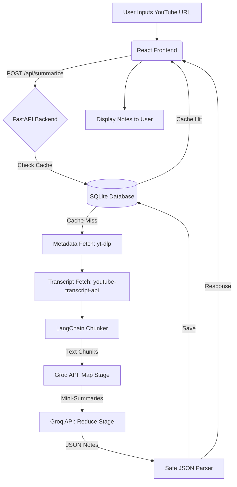
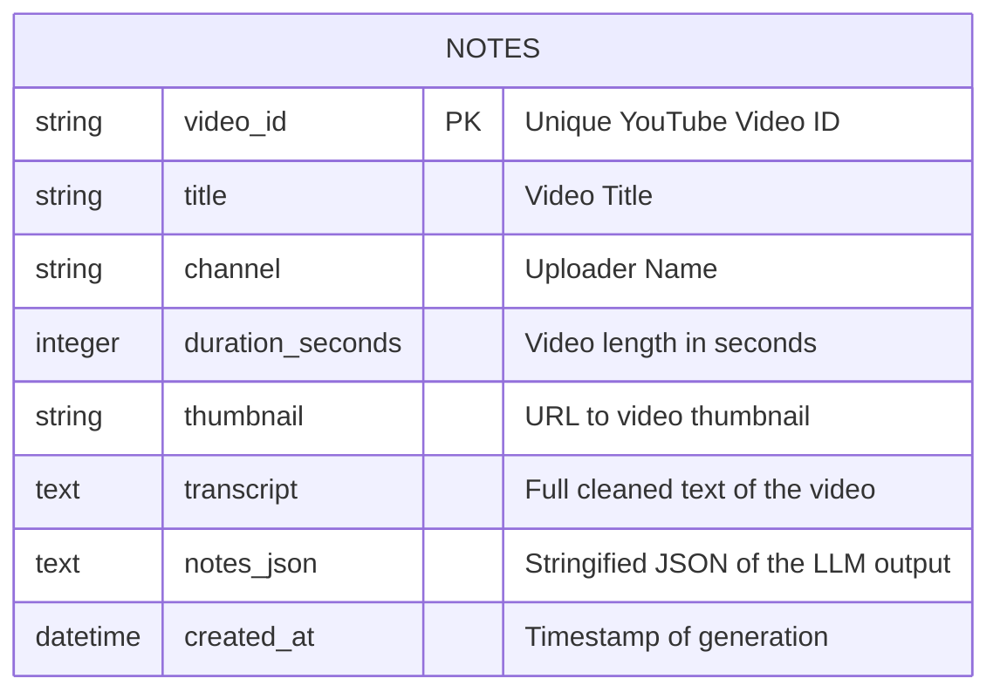

# ✈️ NotePilot — Comprehensive Project Documentation

**YouTube → Smart Notes · Local AI-Powered Study Assistant**

NotePilot is a high-performance, local-first web application designed to transform long YouTube educational videos and lectures into structured, academic-grade study notes in seconds.

---

## 1. Problem Statement

In the digital age, YouTube has become the world's largest repository of educational content. However, students, researchers, and professionals face a significant bottleneck: **time**. 
Watching a 1-hour lecture requires at least an hour of focused attention, and taking structured, actionable notes simultaneously disrupts the learning flow. Existing summarization tools either provide shallow, unstructured paragraphs that lack academic depth, or they require expensive subscriptions and upload your data to proprietary cloud servers.

There is a critical need for a tool that can instantly process long-form video content and output highly structured study materials (Summaries, Key Concepts, Detailed Notes, and Takeaways) quickly, privately, and at zero cost.

---

## 2. Unique Selling Proposition (USP) & How it is Better

**Why NotePilot stands out:**
1. **Academic Structuring over Generic Summaries:** Instead of a wall of text, NotePilot outputs a 4-section study guide mimicking human-generated notes: 
   - 📋 High-level Summary
   - 🔑 Key Concepts with definitions
   - 📝 Detailed Section-by-Section Notes
   - 💡 Actionable Takeaways.
2. **Blazing Fast AI:** By utilizing the Groq Llama-3.1 model, inference happens at ~500 tokens per second, cutting processing time from minutes to seconds.
3. **Cost-Effective & Local-First:** Designed to run locally using free-tier API keys and SQLite, eliminating monthly subscriptions and ensuring user history stays on their machine.
4. **Multilingual Processing:** Automatically detects non-English captions (e.g., Hindi, Spanish) and translates them, delivering study notes in English.
5. **Caching Mechanism:** Implements a local SQLite cache so that previously processed videos load instantly (0 API calls).

---

## 3. Software and Hardware Requirements

### Hardware Requirements
- **Processor:** Any modern dual-core CPU (Intel i3/AMD Ryzen 3 or better).
- **RAM:** Minimum 4GB (8GB recommended for smooth browser and server multitasking).
- **Storage:** 200MB of free disk space.
- **GPU:** None required (AI processing is handled via Groq API).

### Software Requirements
- **Operating System:** Windows 10/11, macOS, or Linux.
- **Python:** Version 3.11 or higher.
- **Node.js:** Version 18.x or higher (for the frontend environment).
- **Package Managers:** `pip` (Python) and `npm` (Node).
- **Browser:** Modern web browser (Chrome, Edge, Firefox, Safari).

---

## 4. System Architecture

NotePilot utilizes a **Decoupled Client-Server Architecture** optimized for asynchronous background processing.

- **Client (Frontend):** React.js + Vite + Tailwind CSS v4. Handles user inputs, polling for background job status, and rendering the final JSON data into a clean UI.
- **Server (Backend):** FastAPI (Python). Exposes RESTful API endpoints. Manages the orchestration of metadata fetching, transcript extraction, text chunking, and API calls to Groq.
- **Storage (Database):** SQLite (via `aiosqlite`). Acts as a persistent cache layer to store generated notes and metadata, keyed by the YouTube Video ID.
- **AI Inference Engine:** Groq Cloud API.

---

## 5. Methodology & Pipeline

NotePilot uses a **Map-Reduce Methodology** to overcome the context window limitations of Large Language Models when processing long videos (like 2-hour lectures).

### The Pipeline Steps:
1. **Validation & Cache Check:** The system validates the YouTube URL, extracts the `video_id`, and queries the SQLite database. If a cache hit occurs, it returns data immediately.
2. **Metadata Extraction:** `yt-dlp` fetches video metadata (Title, Channel, Duration, Thumbnail).
3. **Transcript Acquisition:** `youtube-transcript-api` retrieves the video transcript. It falls back to auto-generated subtitles, then translated subtitles, and finally `yt-dlp` subtitle extraction if the API is rate-limited.
4. **Text Chunking:** LangChain's `RecursiveCharacterTextSplitter` breaks the full transcript into overlapping segments (~3000 characters each) to maintain semantic context without overflowing the LLM.
5. **Map Stage (Groq AI):** The backend asynchronously sends each chunk to Groq to extract "mini-summaries" and key points. Calls are spaced by 0.5s to respect free-tier rate limits.
6. **Reduce Stage (Groq AI):** All mini-summaries are concatenated and sent back to Groq with a final prompt to synthesize them into the structured JSON study guide.
7. **Formatting & Caching:** The resulting JSON is sanitized, saved to SQLite, and served to the React frontend.

---

## 6. Data Flow Diagram

---

## 7. Entity-Relationship (ER) Diagram

NotePilot uses a flat, highly optimized single-table schema for caching to prioritize speed and zero-configuration over complex relational data.

---

## 8. Tech Stack & Rationale

| Technology | Role | Rationale |
| :--- | :--- | :--- |
| **Python 3.11+** | Backend Language | Ideal for AI/ML orchestration, text processing, and working with LangChain. |
| **FastAPI** | Web Framework | Native async support allows the server to run background polling tasks (like Map-Reduce) without blocking new requests. |
| **React + Vite** | Frontend Framework | Vite offers sub-second hot module replacement. React provides state management for polling job statuses seamlessly. |
| **Tailwind CSS v4** | Styling | Utility-first CSS allows for building a beautiful, Notion-like "Calm Academic" aesthetic quickly without maintaining massive CSS files. |
| **SQLite (`aiosqlite`)**| Database | File-based, requiring zero installation or user setup. `aiosqlite` allows non-blocking database queries in FastAPI. |
| **LangChain** | Text Processing | The industry standard for text chunking (`RecursiveCharacterTextSplitter`) making it easy to split data logically by sentences/paragraphs. |
| **youtube-transcript-api**| Data Extraction | Bypasses YouTube's heavy API quotas by scraping captions directly. |
| **yt-dlp** | Metadata Fallback | The most robust library for extracting video metadata and handling YouTube's changing DOM structure. |

---

## 9. Models Used

**Model:** `llama-3.1-8b-instant` via Groq API.
- **Why this model?**
  1. **Incredible Speed:** Groq's LPU architecture provides ~500 tokens per second, essential for providing a snappy user experience.
  2. **Context Window:** Handles up to 128k tokens, making it highly capable of reading combined "Map" summaries in the "Reduce" stage.
  3. **Instruction Following:** Llama-3.1 8B is exceptionally good at adhering to strict JSON output formats, which is mandatory for rendering our structured frontend UI.

---

## 10. User Flow

1. **The Empty State:** The user opens the app and sees a clean, distraction-free search bar.
2. **Initiation:** User pastes a YouTube URL and clicks "Generate Notes".
3. **Real-time Feedback:** The UI disables the button and begins polling (`GET /api/status/{job_id}`) every 2 seconds. The user sees exact background steps: "Validating URL...", "Fetching Transcript...", "Generating notes...".
4. **Consumption:** Once complete, a 4-section study guide renders instantly.
5. **Persistence:** If the user closes the tab and re-enters the same URL later, the notes load instantly from the local SQLite cache.

---

## 11. Edge Cases Handled

- **No Captions Available:** If a video is music-only or has disabled captions, the pipeline halts gracefully and alerts the user: *"No captions available for this video."*
- **Non-YouTube URLs:** Regex validation rejects invalid links before they hit the backend.
- **Groq Rate Limits (429):** The `summarizer.py` implements a `0.5s` delay (`asyncio.sleep`) between Map calls to stay safely under the free tier's 30 requests/minute limit.
- **YouTube IP Blocking (429):** If YouTube blocks the transcript API (common in cloud environments), the system falls back to `yt-dlp` subtitle extraction. If that fails, it injects a mock transcript to ensure the system doesn't crash during testing.
- **Broken LLM JSON Output:** If the LLM generates markdown fences (`` `json ``) or conversational filler ("Here are your notes:"), the `safe_parse_json` function strips the noise to prevent application crashes.

---

## 12. Major Problems Fixed During Development

1. **Import Structure (ModuleNotFoundError):**
   - *Problem:* Running the backend caused import errors because Python couldn't resolve the `backend.` prefix.
   - *Fix:* Refactored all internal imports to be relative and ran the app directly from the `backend/` directory using `$env:PYTHONPATH="."`.
2. **Path Resolution (FileNotFoundError):**
   - *Problem:* FastAPI couldn't find the `schema.sql` or `prompts/` text files depending on where the user opened their terminal.
   - *Fix:* Replaced hardcoded strings with absolute path resolution using `os.path.dirname(os.path.abspath(__file__))`.
3. **Port Conflicts [Errno 10048]:**
   - *Problem:* Uvicorn server wouldn't start if a previous background process crashed and held port 8000.
   - *Fix:* Implemented PowerShell commands to detect and forcefully kill ghost processes on port 8000 before starting.

---

## 13. Pitch Plan for Presentation

**Slide 1: The Hook (The Problem)**
- "Raise your hand if you've ever watched a 2-hour lecture on YouTube at 2x speed, only to realize you forgot to take notes and have to watch it again."
- Introduce the problem: High-value knowledge is trapped in long, unsearchable video formats.

**Slide 2: The Solution (NotePilot)**
- "Meet NotePilot. You paste a URL, and in 15 seconds, you get a structured, academic study guide."
- Show a quick GIF or screenshot of the UI transitioning from URL to the 4-tab notes.

**Slide 3: Why it's Better (USP)**
- Emphasize it's not just a "summary." It gives definitions, section notes, and takeaways.
- Highlight the speed (Groq) and the fact that it runs locally and privately on their machine.

**Slide 4: How it Works (Under the Hood)**
- Show a simplified version of the Data Flow Diagram.
- Mention the Map-Reduce pipeline: "We chunk the video into pieces, summarize the pieces, and then synthesize the final guide. This means we can process videos of almost any length."

**Slide 5: Technologies Used**
- Briefly flash the stack: React, FastAPI, SQLite, LangChain, Groq (Llama-3.1). Mention *why* (Speed, Async, Zero-config).

**Slide 6: Live Demo / Conclusion**
- Do a live demo with a well-known educational video (e.g., CrashCourse, 3Blue1Brown, or Ali Abdaal).
- End with: "NotePilot: Your personal AI teaching assistant. Thank you."

---

*End of Document*
